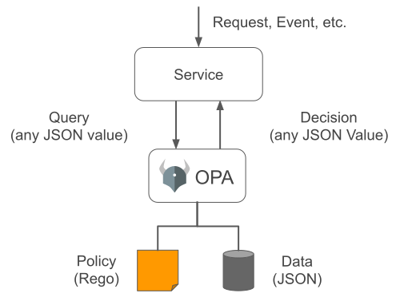

class: center, middle, inverse

# Securing Microservices with Open Policy Agent and Envoy

.right[[**Shane Soh**](https://www.linkedin.com/in/shane-soh/)]
.right[Senior Software Engineer]
.right[Ministry of Defence, Singapore]
---

# Background

### Who are we? 
**Centre for Strategic Infocomm Technologies (CSIT)** is an agency in MINDEF that builds technologies to safeguard the
national security interests of Singapore. 

Our team builds developer platforms and infrastructure that are used in a wide range of mission-critical operations,
such as in counter-terrorism and computer network defence.

---

# Background

### This brings about unique challenges...

* Classified *low-trust* environments where complex access control and stringent audit logging are required for internal
  APIs 

* Increasingly more microservices but still many monolithic legacy systems running on VMs

* Need for API security that is easy to implement and to reason with

Thus **Open Policy Agent (OPA)** and **Envoy**

---

# What is OPA?

Open Policy Agent is a lightweight general-purpose **policy engine** that lets you specify policy as code and use APIs
to offload policy decision-making from your software.

.center.image-60[]

---

# What is Envoy

.center.image-40[]

Envoy is an open source edge and service proxy designed for cloud-native applications.

For our purpose, Envoy is used to delegate authz decisions to OPA, allowing/denying requests to the upstream service
based on OPA's policy decisions.

---

# Putting Them Together

.center[]
TODO: flip diagram around so request comes from top

* Envoy and OPA are deployed alongside service

* An incoming request first goes to Envoy which checks with OPA whether said request should be allowed through

* Upstream service can simply assume any request that arrives is authorized as per OPA policies

---

# Sample Project

.footnote[[github.com/shanesoh/envoy-opa-compose](https://github.com/shanesoh/envoy-opa-compose)]

`docker-compose.yml`
```yaml
  opa:
    image: openpolicyagent/opa:0.21.1-istio
    volumes:
      - ./policy.rego:/config/policy.rego
    command:
      - "run"
      - "--log-level=debug"
      - "--log-format=json-pretty"
      - "--server"
      - "--set=plugins.envoy_ext_authz_grpc.addr=:9191"
      - "--set=decision_logs.console=true"
      - "/config/policy.rego"
```

* `envoy` tagged OPA image uses opa-envoy-plugin which extends OPA with a gRPC that implements the Envoy ext_authz API. 

---

# Sample Project

.footnote[[github.com/shanesoh/envoy-opa-compose](https://github.com/shanesoh/envoy-opa-compose)]

`docker-compose.yml`
```yaml
  envoy:
    build: ./compose/envoy
    ports:
      - "8080:80"
    volumes:
      - ./envoy.yaml:/config/envoy.yaml
    environment:
      - DEBUG_LEVEL=info
      - SERVICE_NAME=app
      - SERVICE_PORT=80
```

* Built Envoy image does environment variable substitution for `envoy.yaml`
    * To simplify adoption as Envoy config can be rather complex

---

# Sample Project

.footnote[[github.com/shanesoh/envoy-opa-compose](https://github.com/shanesoh/envoy-opa-compose)]

`policy.rego`
```shell
package istio.authz

import input.attributes.request.http as http_request

default allow = false

allow = response {
  http_request.method == "GET"
  response := {
      "allowed": true,
      "headers": {"X-Auth-User": "1234"}
  }
}
```

* Toy policy to only allow GET requests and add additional header for `X-Auth-User`

---

# Sample Project

.footnote[[github.com/shanesoh/envoy-opa-compose](https://github.com/shanesoh/envoy-opa-compose)]

In our setup we make authorization decisions primarily using data from OAuth access tokens (in the `Authorization`
header)
    * TODO: Provide example policy that involves parsing JWT for rules
        * Envoy decodes token, passes to OPA as an object, easy to then write rules using it
        * Show example where X-Auth-User is populated from JWT claim

```shell
package istio.authz

import input.attributes.request.http as http_request

default allow = false

allow = response {
  http_request.method == "GET"
  response := {
      "allowed": true,
      "headers": {"X-Auth-User": "1234"}
  }
}
```

---

# Why Do We Like OPA?

--

* Manage policy as code
    * Written in Rego
    * Declarative; relatively easy to read, write and test

--

* Decouple policy decision-making from policy enforcement
    * Authorization logic written outside of service instead of it peppered all over the code
        * Separation of concerns: Developers focus on "business logic" assuming authorization is handled
    * Facilitates discoverability, reuse and governance
    * Policies can be changed and reloaded without restarting service

--

* Centralised management APIs
    * Policy distribution via bundles APIs
    * Collection of telemetry 
        * e.g. Decision logs that are clearly separated from application logs (for audit purposes)

---

# Why Do We Like Envoy?

--

* Filters to implement common functionalities
    * External Authorization (`ext_authz`) to OPA
    * But also JWT Authentication (`jwt_authn`) filter to validate OAuth2 access tokens

--

* Purpose-built for sidecar usage
    * Completely agnostic to upstream service
        * With OPA, useful for tacking on access control to services that don't have them
    * Containerised for Docker or k8s
        * At the same time easy to run on the host for legacy applications
        * Possible to auto inject as k8s sidecars

--

* "Gateway" to service mesh
    * Currently east-west traffic goes through API gateway which provides functionalities like traffic control and
      logging centrally
    * Eases potential adoption of service mesh: Move functionalities into Envoy and use Istio as control plane

---
class: left, middle, inverse

# Thank you.

<i class="fab fa-linkedin"></i> [shane-soh](https://linkedin.com/in/shane-soh) /
<i class="fab fa-github"></i> [shanesoh](https://github.com/shanesoh)

### We're Hiring! [csit.gov.sg](https://www.csit.gov.sg)
